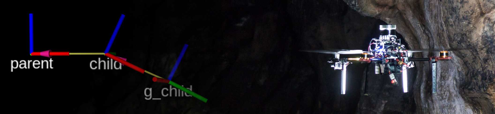

# MRS utils

> :warning: **Attention please: This README is outdated.**
>
> The MRS UAV System 1.5 is being released and this page needs updating. Please, keep in mind that the information on this page might not be valid.

## Overview

This repository contains various useful tools for developement and testing.
Use along with the [MRS UAV system](https://github.com/ctu-mrs/mrs_uav_system).

Contains the following packages

* `tf_reconfigure`: Helper tool for defining a complex transformation as a combination of up to three chained simple transofmrations.

* `tf_estimator`: A tool for calculating an affine transformation to align a trajectory measured in two different coordinate systems.
